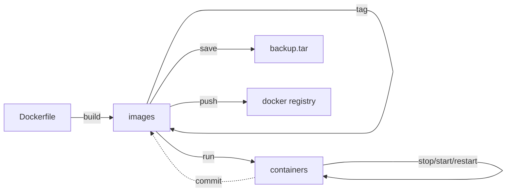

**\<br\>: markdown换行符号**

# docker_exercise
note of docker learn

# 简介
  vmware需要创建完整的操作系统，docker不需要。
  dotCloud公司开发
  使用golang语言开发
  基于Linux内核的Cgroups、Namespace以及Union FS等技术。
  * 作用：对操作系统进行隔离，
# docker引擎
  C/S架构
  docker客户端命令行 - API接口 - 服务器端docker进程（Server Docker Daemon）
  可对网络、容器、镜像、数据卷进行管理。
  ## Docker Daemon（守护进程）
  安装使用docker，需要先运行docker daemon进程，用于管理docker
  ## Docker Client（客户端）
  客户端使用REST API 和 Docker Daemon 进行访问

  ## Docker平台组成

  包含以下三部分：
  
    * 客户端
        Docker的构建、拉取和启动
        可以基于Dockerfile构建镜像
        可以从镜像库拉取镜像 docker pull
    * Docker主机
        包括服务器、容器、镜像
        获取镜像并基于镜像运行出对应容器
    * 镜像仓库

  ### Images
  镜像是一个只读模板。用于构建容器。
  可以通过Dockerfile构建，常用指令：
  |command|mean|
  |:--:|:---|
  |FROM|定义基础镜像|
  |MAINTAINER|作者
  |RUN|运行Linux指令
  |ADD|添加文件/目录
  |ENV|环境变量
  |CMD|运行进程
  
* linux中，docker镜像一般存储位置为：/var/lib/docker
  ### Container
  容器是一个镜像的运行实例。

# docker安装
[官方安装文档](https://docs.docker.com/desktop/install/ubuntu/)

# docker指令

## docker生命周期



  |command|mean|options
  |:--:|:---|:-----------------
  |docker build .|使用Dockerfile构建镜像|
  |docker search ImageName|从dockerhub中查找包含指定名字的镜像|
  |docker pull ImageName|从docker hub拉取指定镜像|
  |docker commit **containerID**|当本地对容器内进行改变时（如安装了某些软件）即可使用commit命令进行提交，提交之后生成的镜像就是携带着你所安装软件的系统镜像|
  |docker push ImageName/ID|将Image推到dockerhub|
  |docker images/image ls|查看本地镜像|-q 只列出ImageID<br> --format 格式化输出，如：docker images --format "{{.ID}}--{{.Repository}}" 只列出镜像的ID和仓库.中间用双横杠连接<br> --format "table {{.ID}}\t{{.Repository}}\t{{.Tag}}" 以表格形式展示
  |docker image inspect ImageID（可以是前三位）|查看指定镜像详细信息|
  |docker rmi ImageName/ID|删除指定镜像|
  |docker rm ContainerID|删除容器记录|
  |docker save ImageNaem/ID|将Image文件保存为.tar文件，方便线下内部传播|
  |docker load ***.tar|将.tar文件加载为Image文件|
  |docker tag||
  |docker run ImageName/ID Command|运行镜像文件生成容器|-d： 后台运行容器<br>-p： -p 宿主机端口:容器内端口,将宿主机端口映射到容器端口，容器内访问该端口就相当与访问宿主机的对应端口 <br>-it 以交互式方式进入容器 <br> --rm 退出容器时删除该容器
  |docker exec [-options] ContainerID command|进入正在运行的容器内并运行指定command指令|
  |docker ps|查看正在运行中的容器|-a 可以查看有哪些容器运行过 <br>
  |docker start ContaineName/ID|启动指定容器|
  |docker stop ContainerNaem/ID|暂停指定容器|
  |docker restart ContainerName/ID|重启指定容器|
  |docker commit ContainerID|在容器内修改后将改动提交到对应Image|


## docker run
    docker run [-options] imageName/imageID

  ### 参数

    -d  后台运行
    -p  localhost:containerhost 将指定宿主机端口映射到指定容器端口

  ### 返回值
    返回一个容器的id。
  ### 示例
    docker -d -p 80:80 nginx
## docker exec


  ### 示例
    docker exec -it xxxxxxxxxxx bash     进入正在运行的ID为xxxxxxxxxxx并运行bash
# docker层级概念

基础镜像提供的是rootfs服务。
上方的多个子镜像若都利用同样的基础镜像，则不需要将基础镜像复制多份。内存里只需要加载一个基础镜像即可为多个容器服务。即使多个容器共享一个base镜像，某个容器修改了base镜像的内容，其他容器的base镜像的内容也是不会被修改的，修改动作只限制在单个容器内，这就是哦哦那个气的写入时复制特性（copy-on-write）。

当容器启动后，一个新的可写层被加载到镜像的顶部，这一层称为容器层，容器层的下方是只读的镜像层。所有对容器的修改操作都只会在容器层产生变化。


## docker中的文件操作
|文件操作|说明|
|:--:|:---|
|添加文件|在容器中创建文件时，新文件会被添加到容器层中|
|读取文件|在容器中读取某个文件时，Docker会从上往下依次在各镜像层中查找此文件。一旦找到，立即将其复制到容器层，然后打开并读入内存|
|修改文件|在容器中修改已经存在的文件时，Docker会从上往下依次在各镜像层中查找此文件，一旦找到，立即将其复制到容器层，然后对其进行修改|
|删除文件|在容器中删除文件时，Docekr从上往下依次在镜像层中查找此文件，找到后，会在容器层中记录下此删除操作（只记录删除操作）|6
## Union FS


# docker使用
## 获取镜像

```bash
## dockerhub获取镜像
docker search ImageName[：tag]    # tag 是镜像版本
docker pull ImageNamerate[：tag]
docker images
# /var/lib/docker/image/overlay2/imagedb/content/sha256/ 记录了镜像和容器的配置关系
docker run -it --rm ImageNmae[：tag] [Command]   # -it 开启交互式终端， --rm退出容器时删除该容器
```
## 查看镜像

```bash
docker images [ImageName:tag]
```


## 删除镜像

```bash
docker rmi ImageName[:tag]  # 被删除的镜像不能有历史容器依赖记录 docker ps -a 查看哪些容器运行过，然后docker rm ContainerID 先删除容器依赖记录.
# 可以指定镜像ID的前三位来删除指定镜像

```
## 镜像管理
```bash
docker rmi `docker images -aq` # 批量删除镜像 慎用
docker rm `docker ps -aq` # 批量删除容器

# 导出镜像，
# 例如默认运行的centos镜像，不提供vim功能，运行该容器后，在容器内安装vim。然后提交该镜像，再导出该镜像为压缩文件发送给其他人使用。
docker image save ImageName：tag > save_dir/save_name.tgz

docker commit

# 导入镜像
docker image load -i save_dir/save_name.tgz

# 查看镜像详细信息
docker info  # 查看当前机器上运行的docker进程的信息
docker image inspect ImageID（可以是前三位） # 查看指定镜像的详细信息

```
## 容器管理

```bash
# 创建和启动容器
docker run ... # 若指定容器不存在则会自动下载

## 容器内的进程必须处于前台运行，否则就会直接推出。若运行镜像生成容器时没有运行任何程序，则容器会直接挂掉。
docker run ImageName:tag bash

## 运行一个活着的容器（docker ps能看到的容器）
docker run ImageName:tag Command


```
