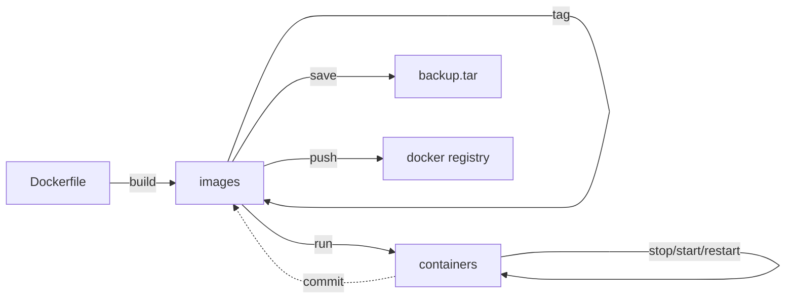

**\<br\>: markdown换行符号**

# docker_exercise
note of docker learn

# 简介
  vmware需要创建完整的操作系统，docker不需要。
  dotCloud公司开发
  使用golang语言开发
  基于Linux内核的Cgroups、Namespace以及Union FS等技术。
  * 作用：对操作系统进行隔离，
# docker引擎
  C/S架构
  docker客户端命令行 - API接口 - 服务器端docker进程（Server Docker Daemon）
  可对网络、容器、镜像、数据卷进行管理。
  ## Docker Daemon（守护进程）
  安装使用docker，需要先运行docker daemon进程，用于管理docker
  ## Docker Client（客户端）
  客户端使用REST API 和 Docker Daemon 进行访问

  ## Docker平台组成

  包含以下三部分：
  
    * 客户端
        Docker的构建、拉取和启动
        可以基于Dockerfile构建镜像
        可以从镜像库拉取镜像 docker pull
    * Docker主机
        包括服务器、容器、镜像
        获取镜像并基于镜像运行出对应容器
    * 镜像仓库

  ### Images
  镜像是一个只读模板。用于构建容器。
  可以通过Dockerfile构建，
  
* linux中，docker镜像一般存储位置为：/var/lib/docker
  ### Container
  容器是一个镜像的运行实例。

# docker安装
[官方安装文档](https://docs.docker.com/desktop/install/ubuntu/)

# docker指令

## docker生命周期



  |command|mean|options
  |:--:|:---|:-----------------
  |docker build [options] .|使用Dockerfile构建镜像|-t "Name" 设置构建后镜像的名字<br>--no-cache 不采用本地缓存镜像层，全部重新下载构建
  |docker search ImageName|从dockerhub中查找包含指定名字的镜像|
  |docker pull ImageName|从docker hub拉取指定镜像|
  |docker commit **containerID**|当本地对容器内进行改变时（如安装了某些软件）即可使用commit命令进行提交，提交之后生成的镜像就是携带着你所安装软件的系统镜像|
  |docker push ImageName/ID|将Image推到dockerhub|
  |docker images/image ls|查看本地镜像|-q 只列出ImageID<br> --format 格式化输出，如：docker images --format "{{.ID}}--{{.Repository}}" 只列出镜像的ID和仓库.中间用双横杠连接<br> --format "table {{.ID}}\t{{.Repository}}\t{{.Tag}}" 以表格形式展示
  |docker image inspect ImageID（可以是前三位）|查看指定镜像详细信息|
  |docker rmi ImageName/ID|删除指定镜像|
  |docker rm ContainerID|删除容器记录|-f 强制删除
  |docker save ImageNaem/ID|将Image文件保存为.tar文件，方便线下内部传播|
  |docker load ***.tar|将.tar文件加载为Image文件|
  |docker tag ImageID ImageName|指定ID修改名字|
  |docker run ImageName/ID Command|运行镜像文件生成容器|-d： 后台运行容器<br>-p： -p 宿主机端口:容器内端口,将宿主机端口映射到容器端口，容器内访问该端口就相当与访问宿主机的对应端口 <br>-it 以交互式方式进入容器 <br> --rm 退出容器时删除该容器对应容器记录 <br> --name 为运行的容器命名<br> -P 随机打开一个本地端口映射到容器内打开的端口<br>-v 数据目录映射<br>--name 指定运行容器的名字<br>--restart [always] 当容器意外关闭时选择其重启方式
  |docker exec [-options] ContainerID command|进入正在运行的容器内并运行指定command指令 <br>-it 以交互式方式进入容器|
  |docker start ContaineName/ID|启动指定容器|
  |docker stop ContainerNaem/ID|暂停指定容器|
  |docker restart ContainerName/ID|重启指定容器|
  |docker commit ContainerID NewName|在容器内修改后将改动提交为指定名字的Image| 
  |docker logs ContainerID|查看指定容器日志|-f 以实时刷新的方式查看日志
  |docker port|查看容器都有哪些端口|
  |docker ps|查看正在运行中的容器|-a 可以查看所有容器记录（默认只查看活着的） <br>
  |docker container ls|等同于docker ps -a|
  |docker top ContinerID|查看容器内运行的资源管理|
  |docker stats ContainerID|查看容器内资源|
  |docker inspect ContainerID|查看容器详细信息|--format 同上面docker images用法相同


## docker run
    docker run [-options] imageName/imageID

  ### 参数

    -d  后台运行
    -p  localhost:containerhost 将指定宿主机端口映射到指定容器端口

  ### 返回值
    返回一个容器的id。
  ### 示例
    docker -d -p 80:80 nginx
## docker exec


  ### 示例
    docker exec -it xxxxxxxxxxx bash     进入正在运行的ID为xxxxxxxxxxx并运行bash
# docker层级概念

基础镜像提供的是rootfs服务。
上方的多个子镜像若都利用同样的基础镜像，则不需要将基础镜像复制多份。内存里只需要加载一个基础镜像即可为多个容器服务。即使多个容器共享一个base镜像，某个容器修改了base镜像的内容，其他容器的base镜像的内容也是不会被修改的，修改动作只限制在单个容器内，这就是哦哦那个气的写入时复制特性（copy-on-write）。

当容器启动后，一个新的可写层被加载到镜像的顶部，这一层称为容器层，容器层的下方是只读的镜像层。所有对容器的修改操作都只会在容器层产生变化。


## docker中的文件操作
|文件操作|说明|
|:--:|:---|
|添加文件|在容器中创建文件时，新文件会被添加到容器层中|
|读取文件|在容器中读取某个文件时，Docker会从上往下依次在各镜像层中查找此文件。一旦找到，立即将其复制到容器层，然后打开并读入内存|
|修改文件|在容器中修改已经存在的文件时，Docker会从上往下依次在各镜像层中查找此文件，一旦找到，立即将其复制到容器层，然后对其进行修改|
|删除文件|在容器中删除文件时，Docekr从上往下依次在镜像层中查找此文件，找到后，会在容器层中记录下此删除操作（只记录删除操作）|6
## Union FS


# docker使用
## 获取镜像

```bash
## dockerhub获取镜像
docker search ImageName[：tag]    # tag 是镜像版本
docker pull ImageNamerate[：tag]
docker images
# /var/lib/docker/image/overlay2/imagedb/content/sha256/ 记录了镜像和容器的配置关系
docker run -it --rm ImageNmae[：tag] [Command]   # -it 开启交互式终端， --rm退出容器时删除该容器
```
## 查看镜像

```bash
docker images [ImageName:tag]
```


## 删除镜像

```bash
docker rmi ImageName[:tag]  # 被删除的镜像不能有历史容器依赖记录 docker ps -a 查看哪些容器运行过，然后docker rm ContainerID 先删除容器依赖记录.
# 可以指定镜像ID的前三位来删除指定镜像

```
## 镜像管理

```bash
docker rmi `docker images -aq` # 批量删除镜像 慎用
docker rm `docker ps -aq` # 批量删除容器

# 导出镜像，
# 例如默认运行的centos镜像，不提供vim功能，运行该容器后，在容器内安装vim。然后提交该镜像，再导出该镜像为压缩文件发送给其他人使用。
docker image save ImageName：tag > save_dir/save_name.tgz

docker commit

# 导入镜像
docker image load -i save_dir/save_name.tgz

# 查看镜像详细信息
docker info  # 查看当前机器上运行的docker进程的信息
docker image inspect ImageID（可以是前三位） # 查看指定镜像的详细信息

```
## 容器管理

```bash
# 创建和启动容器
docker run ... # 若指定容器不存在则会自动下载

## 容器内必须有一个进程处于前台运行，否则就会直接退出。若运行镜像生成容器时没有运行任何程序，则容器会直接挂掉。
docker run ImageName:tag bash

## 运行一个活着的容器（docker ps能看到的容器）。每执行一次 docker run就会生成一条容器记录，使用docker ps -a可以看到。但是有容器记录的容器并不一定都活着，如果其内部没有运行任何进程就会挂掉。
docker run ImageName[:tag] [Command]

## 使用-d参数可以让容器在后台运行，不会占用宿主机的交互窗口。会返回一个容器id。
docker run -d ImageName:tag bash

## 查看容器日志
docker logs -f ContainerID  # 以实时刷新的方式查看容器日志
docker logs ContainerID | tail -10 # 查看容器最新的10条日志

## 进入正在运行的容器空间
docker exec -it ContainerID [Command] # 进入正在运行的容器空间并执行指定命令

## 查看容器的详细信息
docker container inspect ConatinerID  # 返回容器详细信息，json数据

## 容器端口映射
docker run -p local_port:container_port ImageName[:tag] [Command]  # 例如：docker run -p 85:80 ImageName[:tag] Command

## 查看容器端口转发情况
docker port

## 随机端口映射。随机打开一个本地端口映射到容器内打开的端口。
docker run -P ImageName[:tag] Command  # 例如：docker run -P ImageName[:tag] [Command]

## 容器提交
*1.运行基础镜像
*2.在镜像内进行修改（如安装软件）
*3.提交修改后的镜像
*4.再运行镜像则自动包含修改的内容
docker commit Container NewName  # 修改的后的容器会提交为指定名字的新镜像。
```
# Dockerfile

用于构建docker镜像的文件.相当于一个脚本,使用docker自己指令来构建软件依赖、文件依赖、存储等等。

镜像是多层结构，每一层都在前一层的基础上进行修改。容器也是多层存储，以镜像为基础层，在其基础上加一层作为容器运行时的存储层。
创建镜像有两种方法：
  1. 手动修改容器内容然后commit
  2. 通过dockerfile中定义一系列命令和参数构成的脚本，然后这些命令应用于基础镜像，依次添加层，最终生成一个新的镜像，极大简化部署工作。

## 镜像主要组成部分
1. 基础镜像 FROM ImageName:tag   # 同docker pull效果相同
2. 制作镜像操作指令 RUN yum install openssh-server -y
3. 容器启动时执行指令 CMD ["/bin/bash"]

## 常用指令：
  |command|mean|notes
  |:--:|:---|:------
  |FROM|定义基础镜像|
  |MAINTAINER|作者|
  |RUN|运行Linux指令|
  |ADD|添加文件/目录|
  |COPY|同ADD，都是拷贝宿主机文件到容器内，不过ADD多了自动解压的功能|COPY local_files ImageDir, 保留宿主机文件的元数据，如权限、访问时间。<br>支持获取url，若目标文件时url路径 ，会自动下载该链接并放入目标路径，权限自动设置为600，可在后面跟RUN命令进行修改权限等操作。
  |WORKDIR|设置当前工作目录， 相当于cd命令|
  |VOLUME|设置卷，挂在主机目录|VOLUME ["DIR1", "DIR2"...],指定目录自动与宿主机建立映射关系
  |EXPOSE|指定对外端口，在容器内暴露一个窗口|帮助使用该镜像的人快速理解该容器的端口业务<br> docker port 容器 查看打开了什么端口<br>相关指令：<br>docker run -p local_port:container_port <br>docker -P rand_local_port:container_port
  |ENV|环境变量，容器运行时也起作用|
  |ARG|用于构建容器时设置变量，容器运行时不起作用|
  |CMD|运行进程|CMD ["arg1", "arg2"...],镜像运行时默认执行的文件名称或命令。<br>如果docker run时指定了需要执行的命令，则会覆盖该命令后的指令。
  |ENTRYPOINT|容器启动后执行的命令，与CMD作用相同。但是如果同时使用了CMD和ENTRYPOINT,则会把CMD的内容传递给ENTRYPOINT，也可以在docker run的时候直接传参数。 |
  |USER|用于改变环境、切换用户|USER UserName 设定后续操作用哪个用户进行
构建完Dockerfile后，在其所在目录下运行**docker build .** 即可生成镜像
## 示例
1. 构建ubuntu容器，且运行后打印“hello docker”
```text
FROM ubuntu
RUN echo “hello docker”
```


