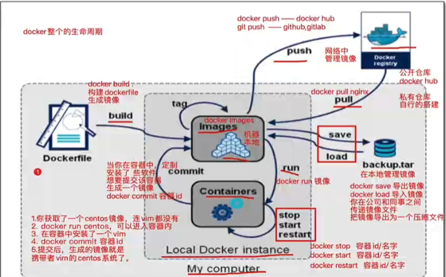
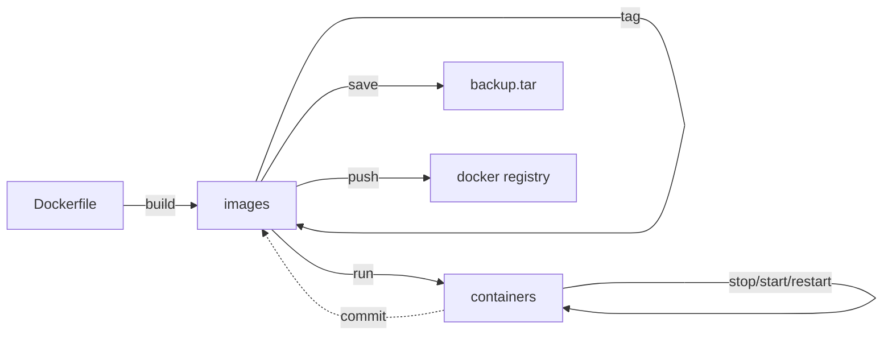

**\<br\>: markdown换行符号**

# docker_exercise
note of docker learn

# 简介
  vmware需要创建完整的操作系统，docker不需要。
  dotCloud公司开发
  使用golang语言开发
  基于Linux内核的Cgroups、Namespace以及Union FS等技术。
  * 作用：对操作系统进行隔离，
# docker引擎
  C/S架构
  docker客户端命令行 - API接口 - 服务器端docker进程（Server Docker Daemon）
  可对网络、容器、镜像、数据卷进行管理。
  ## Docker Daemon（守护进程）
  安装使用docker，需要先运行docker daemon进程，用于管理docker
  ## Docker Client（客户端）
  客户端使用REST API 和 Docker Daemon 进行访问

  ## Docker平台组成

  包含以下三部分：
  
    * 客户端
        Docker的构建、拉取和启动
        可以基于Dockerfile构建镜像
        可以从镜像库拉取镜像 docker pull
    * Docker主机
        包括服务器、容器、镜像
        获取镜像并基于镜像运行出对应容器
    * 镜像仓库

  ### Images
  镜像是一个只读模板。用于构建容器。
  可以通过Dockerfile构建，常用指令：
  |command|mean|
  |:--:|:---|
  |FROM|定义基础镜像|
  |MAINTAINER|作者
  |RUN|运行Linux指令
  |ADD|添加文件/目录
  |ENV|环境变量
  |CMD|运行进程
  
* linux中，docker镜像一般存储位置为：/var/lib/docker
  ### Container
  容器是一个镜像的运行实例。

# docker安装
[官方安装文档](https://docs.docker.com/desktop/install/ubuntu/)

# docker指令

## docker生命周期

  |command|mean|options
  |:--:|:---|:-----------------
  |docker build .|使用Dockerfile构建镜像|
  |docker search ImageName|从dockerhub中查找包含指定名字的镜像|
  |docker pull ImageName|从docker hub拉取指定镜像|
  |docker commit **containerID**|当本地对容器内进行改变时（如安装了某些软件）即可使用commit命令进行提交，提交之后生成的镜像就是携带着你所安装软件的系统镜像|
  |docker push ImageName/ID|将Image推到dockerhub|
  |docker images/image ls|查看本地镜像|
  |docker rmi ImageName/ID|删除指定镜像|
  |docker save ImageNaem/ID|将Image文件保存为.tar文件，方便线下内部传播|
  |docker load ***.tar|将.tar文件加载为Image文件|
  |docker tag||
  |docker run ImageName/ID|运行镜像文件生成容器|-d： 后台运行容器 -p： -p 宿主机端口:容器内端口,将宿主机端口映射到容器端口，容器内访问该端口就相当与访问宿主机的对应端口
  |docker ps|查看正在运行中的容器|
  |docker start ContaineName/ID|启动指定容器|
  |docker stop ContainerNaem/ID|暂停指定容器|
  |docker restart ContainerName/ID|重启指定容器|
  |docker commit ContainerID|在容器内修改后将改动提交到对应Image|

## docker run
    docker run [-options] imageName/imageID

  ### 参数

    -d  后台运行
    -p  localhost:containerhost 将指定宿主机端口映射到指定容器端口

  ### 返回值
    返回一个容器的id。

